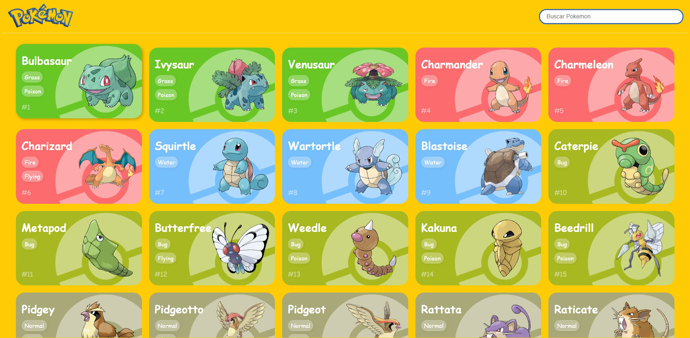
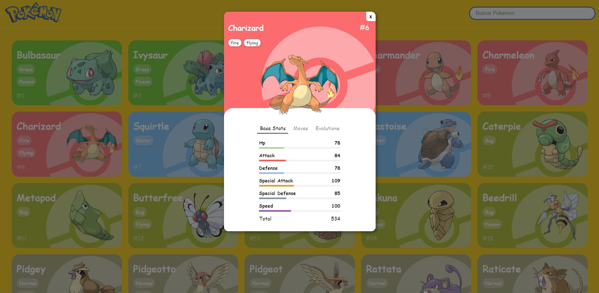
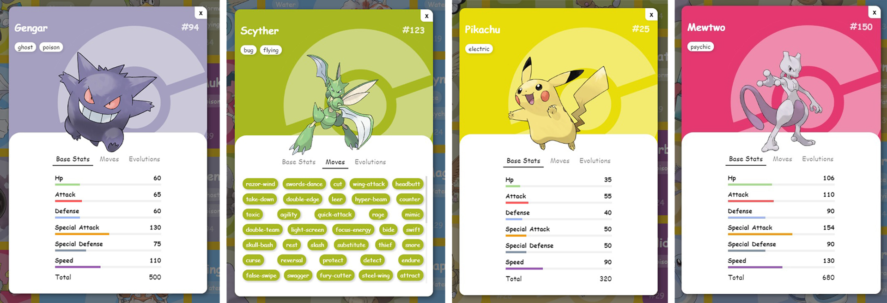

<h1 align="center">React Pokedex</h1>

 <a href="#objetivo">Objetivo</a> •
 <a href="#preview">Preview</a> •
 <a href="#funcionalidades">Funcionalidades</a> • 
 <a href="#tecnologias">Tecnologias utilizadas</a> • 
 <a href="#instalacao">Instalação</a> • 
 <a href="#autor">Autor</a>

<h3 align="center">🚧  Projeto 🚀 Em construção...  🚧</h3>

<h3 id="objetivo">🔖 Objetivo</h3>

🚀 Projeto desenvolvido para fins de estudo da biblioteca React JS com o consumo de uma 
 <a href="https://pokeapi.co/" target="_blank">API REST (PokeAPI)</a>.

<h3 id="preview">🖥️ Preview do projeto</h3>

<h3 id="funcionalidades">✅ Funcionalidades</h3>

- [x] Listagem de todos os pokemons - 1ª GEN
- [x] Informações sobre o pokemon
- [x] Informações sobre o pokemon - Modal
- [x] Informações sobre o pokemon - NavTabs
- [ ] Informações sobre o pokemon - Sobre
- [x] Informações sobre o pokemon - Status base 
- [x] Informações sobre o pokemon - Todos os movimentos
- [ ] Informações sobre o pokemon - Evoluções (Em desenvolvimento)
- [ ] Transformar em responsivo
- [ ] Filtrar pokemon
- [ ] Favoritar pokemon

<h3 id="instalacao">🎲 Rodando o projeto</h3>

#### Pré-requisitos

Antes de começar, você vai precisar ter instalado em sua máquina as seguintes ferramentas:
[Git](https://git-scm.com), [Node.js](https://nodejs.org/en/). 

#### Clone este repositório
`$ git clone <https://github.com/eriick505/react-pokedex>`

#### Acesse a pasta do projeto no terminal/cmd
`$ cd react-pokedex`

#### Instale as dependências
`$ npm install` 

#### Execute a aplicação em modo de desenvolvimento
`$ npm start`

<h3 id="tecnologias">⚡ Tecnologias utilizadas</h3>

- ⚛️ React JS.

<h3 id="autor">😄 Autor</h3>

Desenvolvido por <a href="https://github.com/eriick505/"><b>Erick Santos</b></a>  
  👋🏽 Entre em contato!

  

